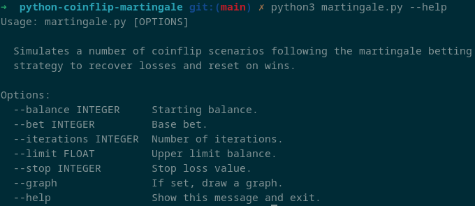
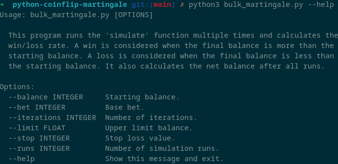

# python-coinflip-martingale

This project contains two python scripts, `martingale.py` and `bulk_martingale.py`, designed to simulate the Martingale betting strategy on a simple coin flip game.

## martingale.py

`martingale.py` simulates a single run of the Martingale betting strategy. The player begins with a specific balance and a base bet. The player flips a coin: if the result is favorable, they gain the amount equivalent to their bet and the bet resets back to the base amount. But if the coin flip results in a loss, they lose the amount of their bet and the bet doubles. The game concludes after a defined number of iterations or when the player's balance touches either a stop loss value or an upper boundary value.

### Flags

| Flag | Description | Default |
| ---- | ----------- | ------- |
| `--balance` | Initial balance | 1000 |
| `--bet` | Base bet | 10 |
| `--iterations` | Number of iterations | 100 |
| `--limit` | Upper boundary | 10000 |
| `--stop` | Stop loss | 0 |

## bulk_martingale.py

`bulk_martingale.py` uses the `simulate` function from `martingale.py` multiple times to generate multiple run simulations. It calculates the win and loss rate, as well as the net balance after all runs. A 'win' is achieved when the final balance exceeds the initial balance, while a 'loss' is registered when the final balance is less than the initial balance. 

Additionally, this script uses Plotly to generate a graph showing the distribution of final balances of each run, represented by different gambler names, generated using the Faker library.

### Flags

| Flag | Description | Default |
| ---- | ----------- | ------- |
| `--balance` | Initial balance | 1000 |
| `--bet` | Base bet | 10 |
| `--iterations` | Number of iterations | 100 |
| `--limit` | Upper boundary | 10000 |
| `--stop` | Stop loss | 0 |
| `--runs` | Number of runs | 100 |
| `--graph` | Graph results with Plotly | False |

## How to run

Both scripts use the `click` library for command line interfaces. To execute a script, navigate to the directory containing the script and type `python <script name>`. Additional configuration options such as balance, bet, iterations, limit, stop, and graph (for `martingale.py`) or runs (for `bulk_martingale.py`) can be specified as command-line arguments.

Run `python <script name> --help` for more information.

## Dependencies

- Python 3
- Click
- Plotly (for graphing capability in `martingale.py` and `bulk_martingale.py`) 
- Faker (for generating synthetic names in `bulk_martingale.py`)

## Disclaimer

This project is intended solely for educational and simulation purposes. The Martingale betting strategy inherently carries high risk and should not be applied for actual betting.